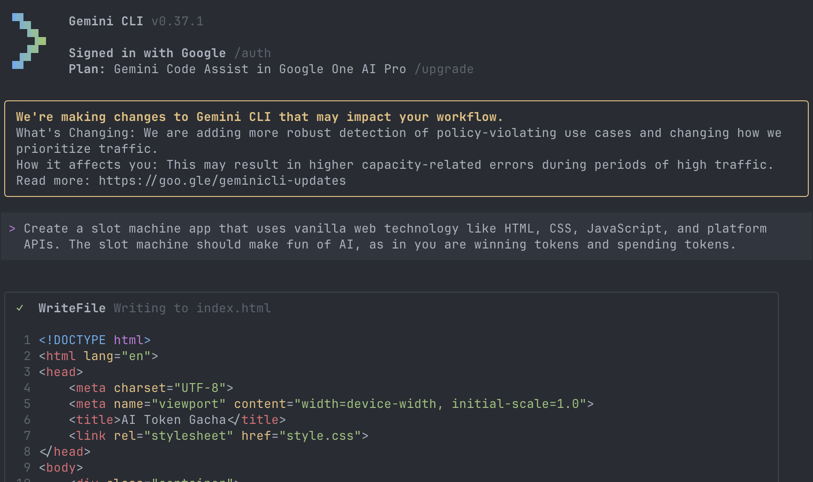
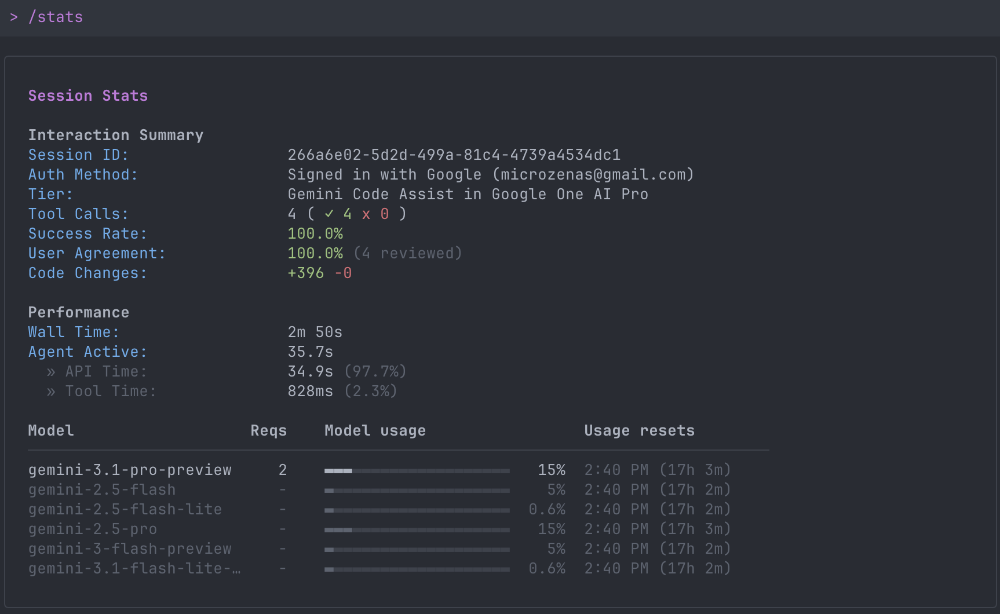
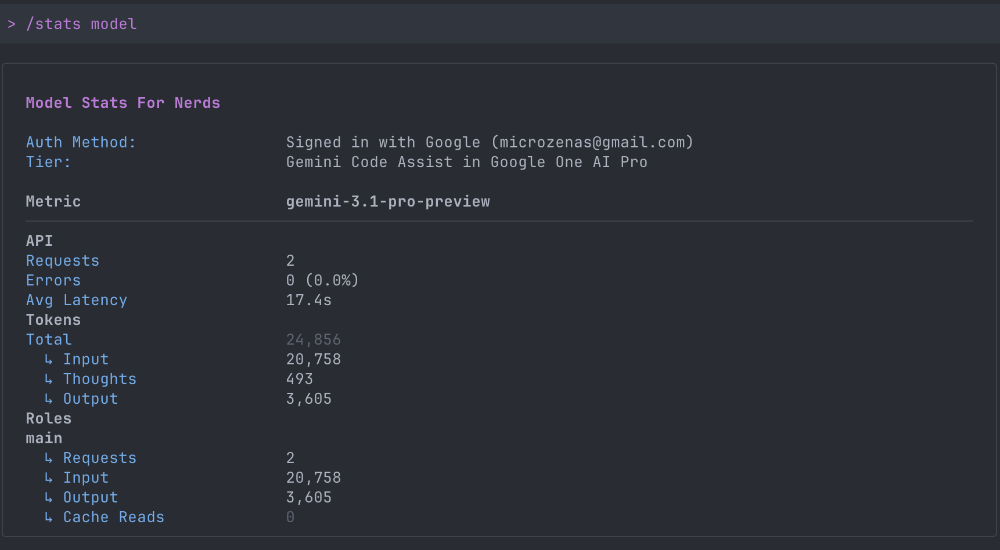
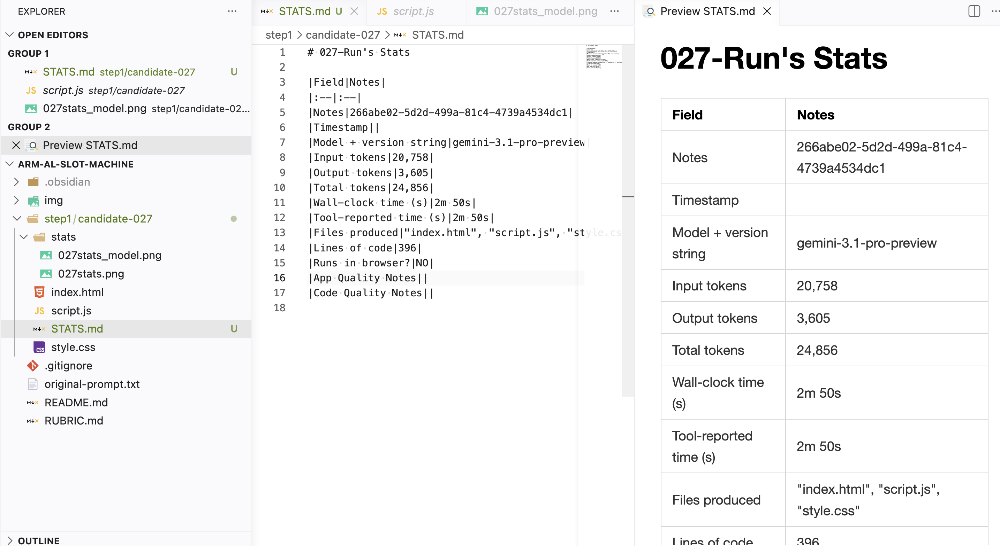

# Demo and Instruction

1). Install [Gemini Code Assist](https://github.com/google-gemini/gemini-cli)

2). Terminal:
```bash
>  gemini -m gemini-3.1-pro-preview --yolo
```

3). Prompt: Create a slot machine app that uses vanilla web technology like HTML, CSS, JavaScript, and platform APIs. The slot machine should make fun of AI, as in you are winning tokens and spending tokens.

Then you will get


4). Stats and token
```bash
/stats
/stats model
```



5). Measure

Add the info to the `STATS.md`



# Timestamp
Read your gemini's log files. Usage: `python timestamp.py <start_number> <end_number>`

Example:

```python
python timestamp.py 27 37
'''
===========================================================================
Folder          | Timestamp    | Local Time (LA)
===========================================================================
candidate-027   | 1775948940   | 2026-04-11 16:09:00 (PT)
  └─ Message: Successfully created and wrote to new file: /Users/microzenas/Project/cse110/arm-al-slot-machine/step1/candidate-027/index.html. Here is the updated code:

candidate-028   | 1776016740   | 2026-04-12 10:59:00 (PT)
  └─ Message: Successfully created and wrote to new file: /Users/microzenas/Project/cse110/arm-al-slot-machine/step1/candidate-028/index.html. Here is the updated code:

candidate-029   | 1776017700   | 2026-04-12 11:15:00 (PT)
  └─ Message: Successfully created and wrote to new file: /Users/microzenas/Project/cse110/arm-al-slot-machine/step1/candidate-029/index.html. Here is the updated code:

candidate-030   | 1776018060   | 2026-04-12 11:21:00 (PT)
  └─ Message: Successfully created and wrote to new file: /Users/microzenas/Project/cse110/arm-al-slot-machine/step1/candidate-030/index.html. Here is the updated code:

candidate-031   | 1776018300   | 2026-04-12 11:25:00 (PT)
  └─ Message: Successfully created and wrote to new file: /Users/microzenas/Project/cse110/arm-al-slot-machine/step1/candidate-031/index.html. Here is the updated code:

candidate-032   | 1776023640   | 2026-04-12 12:54:00 (PT)
  └─ Message: Successfully created and wrote to new file: /Users/microzenas/Project/cse110/arm-al-slot-machine/step1/candidate-032/index.html. Here is the updated code:

candidate-033   | 1776023820   | 2026-04-12 12:57:00 (PT)
  └─ Message: Successfully created and wrote to new file: /Users/microzenas/Project/cse110/arm-al-slot-machine/step1/candidate-033/index.html. Here is the updated code:

candidate-034   | 1776024000   | 2026-04-12 13:00:00 (PT)
  └─ Message: Successfully created and wrote to new file: /Users/microzenas/Project/cse110/arm-al-slot-machine/step1/candidate-034/index.html. Here is the updated code:

candidate-035   | 1776024120   | 2026-04-12 13:02:00 (PT)
  └─ Message: Successfully created and wrote to new file: /Users/microzenas/Project/cse110/arm-al-slot-machine/step1/candidate-035/index.html. Here is the updated code:

candidate-036   | 1776024240   | 2026-04-12 13:04:00 (PT)
  └─ Message: Successfully created and wrote to new file: /Users/microzenas/Project/cse110/arm-al-slot-machine/step1/candidate-036/index.html. Here is the updated code:

candidate-037   | 1776024420   | 2026-04-12 13:07:00 (PT)
  └─ Message: Successfully created and wrote to new file: /Users/microzenas/Project/cse110/arm-al-slot-machine/step1/candidate-037/index.html. Here is the updated code:
'''
```